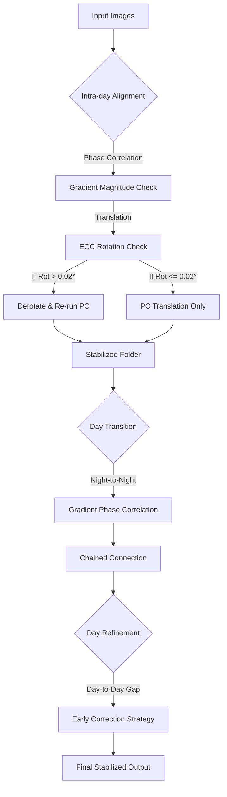

# 🎬 Timelapse Image Aligner

타임랩스 촬영 이미지의 흔들림을 보정하고 영상으로 만드는 도구 모음입니다.

---

## 📁 프로젝트 구조

```
aligner/
├── stabilize_phase.py       # 메인: 자동 흔들림 + 회전 보정
├── create_video.py          # 영상 생성 (배치 처리)
├── requirements.txt         # Python 의존성
├── README.md
└── util/                    # 유틸리티 및 개발용 스크립트
    ├── manual_align_gui.py  # 수동 정렬 GUI
    ├── review_outliers.py   # 아웃라이어 검토
    ├── refine_day_alignment.py  # 날짜별 보정 (단독 실행용)
    ├── stabilize_neighbor.py    # (개발용) 이웃 정렬 테스트
    ├── check_alignment.py       # (개발용) 정합 검증
    └── test_outlier_align.py    # (개발용) 아웃라이어 테스트
```

---

## 🔧 설치

### 필수 요구사항
- Python 3.8+
- FFmpeg (시스템 PATH에 설치)

### Python 패키지 설치
```bash
pip install -r requirements.txt
```

---

## 🛠️ 도구 설명

### 1. `stabilize_phase.py` - 자동 흔들림 보정 (메인)
 
Phase Correlation + ECC 알고리즘을 사용하여 이미지 시퀀스의 흔들림과 회전을 자동으로 보정합니다.

**🚀 Alignment Pipeline Flow:**



**알고리즘 상세 (Advanced Logic):**

1. **Hybrid Alignment (ECC + Gradient PC)**
   - **회전(Rotation)**: ECC 알고리즘을 사용하여 0.02° 이상의 미세한 회전까지 정밀하게 감지합니다.
   - **이동(Translation)**: 회전이 감지되면 이미지를 역회전(Derotate)시킨 후, **Gradient Phase Correlation**을 다시 수행하여 순수한 이동량을 계산합니다. 이로써 회전으로 인한 이동량 왜곡을 원천 차단합니다.

2. **Gradient Phase Correlation**
   - 단순 Edge나 Pixel Intensity 대신 **Gradient Magnitude**를 사용하여 조명 변화에 강인합니다. 

3. **Center Rotation Correction**
   - 이미지 **중심(Center)**을 기준으로 회전하여 보정합니다.

4. **Early Day Refinement (Morning Correction)**
   - 아침 시간대(앞 20% 구간)에 빠르게 위치를 바로잡아, **밝은 낮 시간에는 완벽하게 고정된 화면**을 제공합니다.
   - Sub-pixel(0.5px) 제약 조건을 준수하여 보정이 눈에 띄지 않도록 부드럽게 처리합니다.

**핵심 기능:**
| 기능 | 설명 |
|------|------|
| **Gradient PC** | 조명 변화에 강한 정합 (Edge보다 강력) |
| **Center Rotation** | 중심축 기준 정밀 회전 보정 |
| **Early Refine** | 아침에 빠르게 자리 잡아 낮 시간 고정 |
| **Deadzone** | ±3px 미세 흔들림 무시 (Damping) |

**사용법:**
```bash
# 기본 실행 (input → output, Day Refinement 포함)
python stabilize_phase.py

# 커스텀 폴더 지정
python stabilize_phase.py -i my_input -o my_output

# 보정 + 영상 생성까지
python stabilize_phase.py --video

# 고품질 영상
python stabilize_phase.py --video --fps 30 --crf 18

# Day Refinement 건너뛰기
python stabilize_phase.py --no-refine

# 이미 보정된 폴더에 Day Refinement만 다시 적용
python stabilize_phase.py --refine-only
```

**옵션:**
| 옵션 | 설명 | 기본값 |
|------|------|--------|
| `-i`, `--input` | 입력 폴더 | `input` |
| `-o`, `--output` | 출력 폴더 | `output` |
| `--ext` | 이미지 확장자 | `jpg` |
| `-v`, `--video` | 통합 MP4 생성 | 꺼짐 |
| `--fps` | 영상 FPS | `30` |
| `--crf` | 영상 품질 (0-51, 낮을수록 고품질) | `18` |
| `--batch` | 영상 배치당 이미지 수 | `500` |
| `--no-refine` | Day-level Refinement 건너뛰기 | 꺼짐 |

**하위 폴더 자동 처리:**

날짜별로 폴더가 분리된 경우, 자동으로 체인 연결하여 처리합니다.

```
input/                    output/
├── 2026-01-01/    →     ├── 2026-01-01/
├── 2026-01-02/    →     ├── 2026-01-02/
└── 2026-01-03/    →     ├── 2026-01-03/
                         ├── logs/
                         │   ├── [timestamp]_full.txt
                         │   └── [timestamp]_outliers.txt
                         └── combined_all.mp4
```

**출력 파일:**
| 파일 | 설명 |
|------|------|
| `output/[폴더]/[이미지].jpg` | 보정된 이미지 |
| `output/logs/[timestamp]_full.txt` | 전체 보정 로그 |
| `output/logs/[timestamp]_outliers.txt` | 아웃라이어 목록 |
| `output/combined_all.mp4` | 통합 영상 (--video 옵션) |

**설정값:**
| 항목 | 값 | 설명 |
|------|-----|------|
| Rotation Threshold | 0.02° | 이 이상 회전 시 ECC 보정 |
| Damping Deadzone | 3px | 이 범위 내에서는 Damping 미적용 |
| Damping Factor | 0.99 | 프레임당 1% 원점 복귀 |
| Day Refine Samples | 30 | 날짜당 랜덤 샘플 수 |

---

### 2. `stabilize_parallel.py` - 고속 병렬 처리 (권장)

`stabilize_phase.py`와 동일한 정밀 알고리즘(Hybrid Alignment, Early Refine)을 사용하지만, **멀티코어 병렬 처리**를 통해 속도를 획기적으로 향상시킨 버전입니다.

**특징:**
- **🚀 압도적인 속도**: CPU 코어를 모두 활용하여 분석(Analysis)과 렌더링(Rendering)을 병렬로 수행합니다. (기존 대비 5~10배 빠름)
- **Log-First**: 이미지 저장 전에 로그 파일(`full_log.txt`)을 먼저 생성하여 빠른 결과 검증이 가능합니다.
- **Two-Pass 구조**: 분석 단계에서 이미지를 저장하지 않아 I/O 병목을 최소화했습니다.

**사용법:**
```bash
# 기본 실행 (자동으로 가용 CPU 코어 사용)
python stabilize_parallel.py --video

# 워커 프로세스 수 수동 지정 (예: 8개)
python stabilize_parallel.py --video --workers 8

# 결과물은 'output_parallel' 폴더에 저장됩니다.
```

**언제 사용하나요?**
- 이미지가 수천 장 이상일 때
- 빠른 처리가 필요할 때
- 로직 테스트보다 결과물 생산이 목적일 때

---

### 3. `create_video.py` - 메모리 효율적 영상 생성

대량의 이미지를 배치로 나눠 처리하여 메모리 부족 문제를 해결합니다.

**동작 원리:**
1. 이미지를 배치(기본 200장)로 분할
2. 각 배치를 개별 MP4로 인코딩
3. 생성된 MP4들을 스트림 복사로 빠르게 병합
4. 임시 파일 자동 정리

**사용법:**
```bash
python create_video.py --input INPUT_FOLDER --output OUTPUT.mp4 [OPTIONS]
```

**옵션:**
| 옵션 | 설명 | 기본값 |
|------|------|--------|
| `--input`, `-i` | 입력 이미지 폴더 | (필수) |
| `--output`, `-o` | 출력 영상 파일 | `output.mp4` |
| `--fps` | 초당 프레임 수 | `30` |
| `--crf` | 품질 (0-51, 낮을수록 고품질) | `18` |
| `--batch` | 배치당 이미지 수 | `200` |
| `--ext` | 이미지 확장자 | `jpg` |

---

### 4. `util/manual_align_gui.py` - 수동 정렬 GUI

두 이미지를 비교하며 수동으로 정렬 오프셋을 조정하는 GUI 도구입니다.

**기능:**
- **Main View**: 전체 이미지 표시
- **Zoom View**: 마우스 위치 기준 4배 확대
- 토글/오버레이로 정밀 비교 가능

**조작법:**
| 키 | 동작 |
|---|---|
| `W` / `A` / `S` / `D` | 1px 이동 (상/좌/하/우) |
| `I` / `J` / `K` / `L` | 10px 이동 (상/좌/하/우) |
| `Arrow Keys` | 0.1px 이동 |
| `Shift + Arrow` | 0.01px 이동 |
| `SPACE` | Reference ↔ Aligned 토글 |
| `Z` | Overlay 모드 (반투명 겹침) |
| `마우스 이동` | 확대 위치 지정 |
| `Q` / `ESC` | 종료 (오프셋 출력) |

**사용법:**
```bash
# 두 이미지 직접 지정
python util/manual_align_gui.py --ref reference.jpg --mov moving.jpg

# 폴더의 처음 두 이미지 사용
python util/manual_align_gui.py --input-dir input
```

---

### 5. `util/review_outliers.py` - 아웃라이어 검토 및 GT 수집

로그에 기록된 스킵된 프레임들을 수동으로 검토하고, Ground Truth를 수집합니다.

**사용법:**
```bash
python util/review_outliers.py --log output/logs/[timestamp]_outliers.txt
```

---

## 📋 일반적인 워크플로우

### 1. 완전 자동 (권장)

```bash
# Step 1: 이미지 폴더를 input에 복사
# input/2026-01-01/, input/2026-01-02/, ...

# Step 2: 자동 보정 + 영상 생성
python stabilize_phase.py --video --fps 30 --crf 23
```

### 2. 단계별 실행

```bash
# Step 1: 보정만 실행
python stabilize_phase.py

# Step 2: 결과 확인 (GUI)
python util/manual_align_gui.py --ref output/2026-01-01/img1.jpg --mov output/2026-01-01/img2.jpg

# Step 3: 영상 생성
python create_video.py -i output -o timelapse.mp4 --fps 30
```

### 3. 아웃라이어 검토

```bash
# outliers.txt 확인 후 수동 검토
python util/review_outliers.py --log output/logs/[timestamp]_outliers.txt
```

---

## 📄 로그 파일 형식

### `output/logs/[timestamp]_full.txt`
```
# Stabilization Log
# Execution: 2026-01-30_10-45
# Date Range: 2026-01-01 to 2026-01-28
# Method: Chained Neighbor + Rotation Correction + Day Refinement
# Rotation Threshold: 0.1°
# Damping: Deadzone=3.0px, Factor=0.99

2026-01-01	2026-01-01_06-00-00.jpg	dx=0.0	dy=0.0	resp=1.000	status=FIRST
2026-01-01	2026-01-01_06-06-00.jpg	dx=0.2	dy=0.1	resp=0.845	status=OK
2026-01-28	2026-01-28_14-00-00.jpg	dx=-5.2	dy=3.1	resp=0.712	status=ROT(0.18°)
```

### `output/logs/[timestamp]_outliers.txt`
```
# Outlier Report
# Total outliers: 2

2026-01-15	2026-01-15_06-12-00.jpg	dx=152.3, dy=87.2, resp=0.021
```

---

## ⚙️ CRF 품질 가이드

| CRF | 설명 | 용도 |
|-----|------|------|
| 0 | 무손실 | 아카이브 |
| 12-14 | 매우 고품질 | 전문가용 |
| **18** | 고품질 (기본값) | 일반 사용 |
| **23** | 중간 품질 | 웹 업로드 (권장) |
| 28+ | 저품질 | 미리보기 |

---

## 🚨 문제 해결

### FFmpeg 메모리 부족
```bash
python stabilize_phase.py --video --batch 100
```

### 영상 재생 끊김
- 해상도가 너무 큼 (4K 이상) → 자동으로 1080p로 다운스케일됨
- CRF 낮추기: `--crf 23`

### 특정 날짜만 흔들림이 심함
- 회전 보정 로그 확인: `status=ROT(0.18°)`
- 해당 날짜 원본 이미지 확인 (바람, 진동 등)

### 날짜 간 점프 발생
- Day Refinement가 적용되었는지 확인
- `--no-refine` 옵션이 있으면 제거

---

## 📝 라이선스

개인 및 상업적 사용 자유
