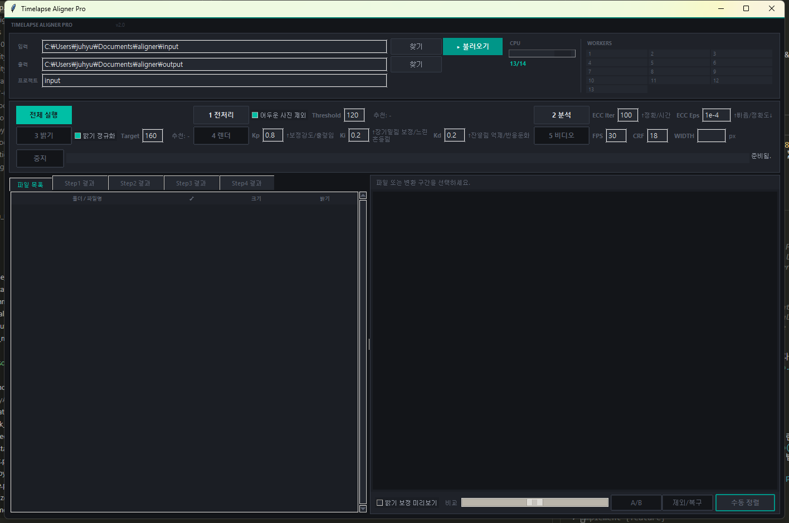
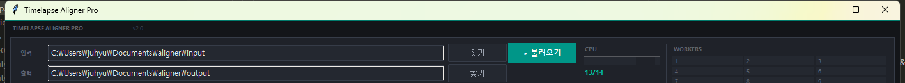
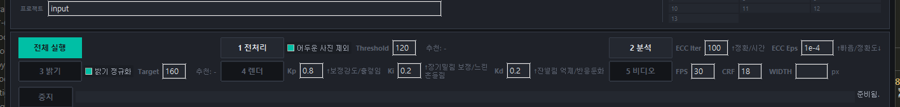

# Timelapse Aligner Pro v2.0 사용 가이드

## 개요

Timelapse Aligner Pro는 타임랩스 촬영 시 날짜별로 발생하는 카메라 위치 변동을 자동으로 보정하여 안정적인 타임랩스 영상을 생성하는 도구입니다.

**주요 기능:**
- 어두운(야간) 사진 자동 감지 및 제외
- ECC 알고리즘 기반 자동 정렬 분석
- 날짜 간 카메라 이동량 자동 계산
- PID 제어 기반 궤적 스무딩
- 밝기 정규화
- 수동 미세 정렬 지원
- MP4 비디오 인코딩 (H.264)

---

## 설치 및 실행

### 필수 요구사항
- Python 3.8 이상
- 필수 패키지: `opencv-python`, `numpy`, `Pillow`
- 비디오 생성: `ffmpeg` (시스템 PATH에 등록 필요)

### 실행 방법
```bash
python gui_main.py
```

---

## 화면 구성

### 전체 레이아웃



앱은 크게 세 영역으로 나뉩니다:
1. **상단 설정 패널** - 입출력 경로, 프로젝트명, CPU 설정, 워커 모니터
2. **작업 단계 패널** - 5단계 파이프라인 버튼과 각 단계별 옵션
3. **메인 패널** - 좌측 파일 브라우저 탭 + 우측 미리보기 패널

### 입출력 설정 영역



| 항목 | 설명 |
|------|------|
| **입력** | 원본 이미지가 저장된 폴더 경로. `찾기` 버튼으로 탐색하거나 직접 입력 |
| **▸ 불러오기** | 입력 폴더의 이미지를 스캔하여 파일 목록에 로드 |
| **출력** | 결과물이 저장될 상위 폴더 경로 |
| **프로젝트** | 프로젝트 이름 (출력 폴더 하위에 이 이름으로 폴더가 생성됨) |
| **CPU** | 병렬 처리에 사용할 CPU 코어 수 (슬라이더로 조절) |
| **WORKERS** | 현재 활성 워커 프로세스의 작업 상태를 실시간 모니터링 |

### 작업 단계 패널



5단계 파이프라인이 2행으로 배치되어 있습니다:

- **1행**: `전체 실행` | `1 전처리` (+ 옵션) | `2 분석` (+ 옵션)
- **2행**: `3 밝기` (+ 옵션) | `4 렌더` (+ 옵션) | `5 비디오` (+ 옵션)

각 단계 버튼의 색상이 상태에 따라 변합니다:
- **회색**: 대기 중 (pending)
- **초록색 (teal)**: 현재 실행 중 (active)
- **녹색**: 완료됨 (done)

하단에는 **중지** 버튼과 **진행률 표시줄**, **상태 메시지**가 표시됩니다.

### 파일 브라우저 탭


좌측에 5개의 탭이 있습니다:

| 탭 | 내용 |
|----|------|
| **파일 목록** | 입력 폴더의 전체 이미지 목록 (체크표시, 크기, 밝기) |
| **Step1 결과** | 전처리 후 제외되지 않은 파일 목록 |
| **Step2 결과** | 날짜 간 변환 분석 결과 (구간, 이동량, 상태) |
| **Step3 결과** | 밝기 보정 후 출력 파일 목록 |
| **Step4 결과** | 렌더링 완료된 출력 파일 목록 |

### 미리보기 패널

우측 패널에서 파일 또는 변환 구간을 선택하면 이미지를 미리볼 수 있습니다.

하단 도구 모음:
- **밝기 보정 미리보기** - 밝기 보정이 적용된 상태로 미리보기
- **비교 슬라이더** - 두 이미지를 블렌딩하여 비교
- **A/B** - 비교 이미지 전환
- **제외/복구** - 선택된 파일을 제외하거나 복구
- **수동 정렬** - 수동 정렬 도구 실행 (Step2 결과 탭에서 구간 선택 시 활성화)

---

## 입력 데이터 준비

### 폴더 구조

입력 폴더는 두 가지 방식으로 구성할 수 있습니다:

**방식 1: 날짜별 하위 폴더** (권장)
```
input/
├── 2024-01-01/
│   ├── IMG_0001.jpg
│   ├── IMG_0002.jpg
│   └── ...
├── 2024-01-02/
│   ├── IMG_0001.jpg
│   └── ...
└── 2024-01-03/
    └── ...
```

**방식 2: 단일 폴더**
```
input/
├── IMG_0001.jpg
├── IMG_0002.jpg
└── ...
```

### 지원 파일 형식

- **JPG** (.jpg) - 기본 지원 형식

> 참고: 폴더 이름에 날짜 형식(예: `2024-01-01`)을 포함하면 비디오 파일명에 날짜 범위가 자동으로 포함됩니다.

---

## 전체 워크플로우

### 전체 실행 (한 번에)

1. 입력 폴더를 설정하고 `▸ 불러오기` 클릭
2. 파일 목록을 확인하고 필요시 제외할 파일 선택
3. 각 단계 옵션을 원하는 값으로 조정
4. **`전체 실행`** 버튼 클릭

전체 실행은 Step 1 → 2 → 4 → 5 순서로 자동 진행됩니다.

### 단계별 실행

각 단계를 개별적으로 실행할 수도 있습니다. 단계별 실행 시 이전 단계가 완료되어야 다음 단계 버튼이 활성화됩니다.

> 작업 중 `중지` 버튼을 누르면 현재 작업을 취소할 수 있습니다.

---

## Step 1: 전처리

### 기능 설명

입력 이미지의 밝기(V채널 평균)를 분석하여 어두운 사진(야간 촬영분)을 자동으로 감지하고 제외합니다.

### 옵션

| 옵션 | 기본값 | 설명 |
|------|--------|------|
| **어두운 사진 제외** | ☑ (활성) | 어두운 사진 자동 제외 기능 ON/OFF |
| **Threshold** | `120` | 밝기 임계값. 이 값 미만의 평균 밝기를 가진 이미지가 제외됨 |

- 전처리 완료 후 `추천:` 라벨에 추천 임계값이 표시됩니다
- 파일 목록에서 각 이미지의 밝기 값을 확인할 수 있습니다
- 제외된 파일은 취소선으로 표시되며, `제외/복구` 버튼으로 수동 조정 가능
- Threshold를 변경 후 다시 `1 전처리`를 누르면 밝기 데이터가 이미 있는 경우 빠르게 재적용됩니다

---

## Step 2: 분석

### 기능 설명

ECC(Enhanced Correlation Coefficient) 알고리즘을 사용하여 연속 이미지 간의 정렬 변환(이동, 회전)을 분석합니다. 또한 날짜 간 카메라 위치 차이(Day Gap)를 계산합니다.

### 옵션

| 옵션 | 기본값 | 설명 |
|------|--------|------|
| **ECC Iter** | `100` | ECC 알고리즘 최대 반복 횟수. ↑ 정확도 향상, 처리 시간 증가 |
| **ECC Eps** | `1e-4` | ECC 수렴 임계값. ↑ 빠른 처리, 정확도 저하 |
| **샘플** | `5` | Day Gap 측정 시 사용할 샘플 수. ↑ 안정적 결과, 처리 시간 증가 |

- 분석 결과는 `output/<프로젝트>/step1_analysis/` 폴더에 JSON으로 캐시됩니다
- 동일 데이터로 재실행 시 캐시를 자동 재사용하여 빠르게 처리됩니다
- 분석 완료 후 **Step2 결과** 탭에서 날짜 간 변환 구간별 이동량과 상태를 확인할 수 있습니다

---

## Step 3: 밝기 보정

### 기능 설명

모든 이미지의 밝기를 목표값으로 정규화하여 타임랩스 영상에서의 밝기 깜빡임을 줄입니다.

### 옵션

| 옵션 | 기본값 | 설명 |
|------|--------|------|
| **밝기 정규화** | ☑ (활성) | 밝기 정규화 기능 ON/OFF |
| **Target** | `160` | 목표 밝기값 (0-255). 모든 이미지가 이 밝기에 가깝도록 조정됨 |

- 보정 완료 후 `추천:` 라벨에 추천 목표값이 표시됩니다
- 결과는 `output/<프로젝트>/step1_normalized/` 폴더에 저장됩니다
- **Step3 결과** 탭에서 보정된 파일 목록을 확인할 수 있습니다

---

## Step 4: 렌더

### 기능 설명

PID 제어 알고리즘으로 카메라 이동 궤적을 스무딩하고, 각 이미지에 보정 변환을 적용하여 안정화된 이미지를 생성합니다.

### 옵션

| 옵션 | 기본값 | 설명 |
|------|--------|------|
| **Kp** (비례) | `0.8` | 보정 강도. ↑ 강한 보정, 출렁임 가능성 |
| **Ki** (적분) | `0.2` | 장기 밀림 보정. ↑ 누적 오차 보정, 느린 흔들림 가능성 |
| **Kd** (미분) | `0.2` | 잔떨림 억제. ↑ 진동 억제, 반응 둔화 |

- 결과는 `output/<프로젝트>/step2_render/` 폴더에 저장됩니다
- **Step4 결과** 탭에서 렌더링된 파일 목록을 확인할 수 있습니다

> **팁**: 기본값으로 시작한 뒤, 결과가 출렁이면 Kp를 낮추고, 서서히 밀리면 Ki를 높이세요.

---

## Step 5: 비디오 생성

### 기능 설명

렌더링된 이미지를 MP4 비디오로 인코딩합니다 (H.264 코덱, ffmpeg 사용).

### 옵션

| 옵션 | 기본값 | 설명 |
|------|--------|------|
| **FPS** | `30` | 초당 프레임 수 |
| **CRF** | `18` | 압축 품질 (0=무손실, 51=최저품질). 낮을수록 고품질, 파일 크기 증가 |
| **WIDTH** | (비어 있음) | 출력 가로 해상도 (px). 비워두면 원본 해상도 유지 |

- 비디오는 `output/<프로젝트>/step3_video/` 폴더에 저장됩니다
- 파일명 형식: `<프로젝트명>_<시작일>_<종료일>_<해상도>.mp4`
- 동일 이름의 파일이 이미 존재하면 타임스탬프가 추가됩니다

---

## 수동 정렬

### 실행 방법

1. **Step 2 분석**을 먼저 완료합니다
2. **Step2 결과** 탭에서 수동 조정하려는 날짜 구간을 선택합니다
3. 우측 하단의 **`수동 정렬`** 버튼을 클릭합니다
4. OpenCV 창이 열리며 두 날짜의 대표 이미지가 오버레이됩니다

### 키보드/마우스 조작법

| 입력 | 동작 |
|------|------|
| **마우스 드래그** | 이미지 이동 |
| **Space** | 기준 이미지 / 정렬 이미지 전환 |
| **Z** | 오버레이 모드 토글 |
| **R** | 이동값 초기화 (0, 0) |
| **Q** | 현재 값 저장 후 종료 |
| **ESC** | 변경사항 취소 후 종료 |

### 정밀도별 이동 키

| 정밀도 | 상 | 하 | 좌 | 우 |
|--------|----|----|----|----|
| **10px** (대) | I | K | J | L |
| **1px** (중) | W | S | A | D |
| **0.1px** (소) | 8 | 2 | 4 | 6 |
| **0.01px** (미세) | 7 | 1 | 3 | 9 |

> 0.01px 키(7, 1, 3, 9)는 대각선 이동입니다: 7=좌상, 1=좌하, 9=우상, 3=우하

- 메인 창 좌측 상단에 현재 모드와 이동값(dx, dy)이 표시됩니다
- **Fine Tune (x4)** 보조 창에서 마우스 위치 주변을 4배 확대하여 확인할 수 있습니다
- 수동 정렬 완료(Q 키) 후 해당 구간의 상태가 "Manual"로 변경됩니다

---

## 출력 결과물

### 폴더 구조

```
output/<프로젝트명>/
├── step1_analysis/
│   ├── analysis_results.json    # 이미지별 정렬 분석 결과
│   └── day_gaps.json            # 날짜 간 이동량 데이터
├── step1_normalized/
│   └── <날짜별 폴더>/           # 밝기 보정된 이미지
│       └── *.jpg
├── step2_render/
│   └── <날짜별 폴더>/           # 정렬 보정 완료된 이미지
│       └── *.jpg
└── step3_video/
    └── <프로젝트>_<날짜>_<해상도>.mp4
```

### 파일 형식

| 출력물 | 형식 | 설명 |
|--------|------|------|
| 분석 결과 | JSON | 재실행 시 캐시로 재사용 |
| 보정 이미지 | JPG | 원본과 동일한 파일명 |
| 비디오 | MP4 (H.264) | CRF 기반 가변 비트레이트 |

---

## FAQ / 팁

**Q: 분석 결과가 만족스럽지 않아요.**
- ECC Iter를 높이거나 ECC Eps를 낮추면 정확도가 향상됩니다
- 어두운 사진이 포함되어 있으면 분석 품질이 저하될 수 있으므로 Threshold를 적절히 설정하세요

**Q: 특정 날짜 구간의 정렬이 어긋나 있어요.**
- Step2 결과 탭에서 해당 구간을 선택한 뒤 `수동 정렬`로 직접 조정하세요
- 조정 후 Step 4부터 다시 실행하면 됩니다

**Q: 비디오 생성이 안 돼요.**
- `ffmpeg`가 시스템 PATH에 등록되어 있는지 확인하세요
- 터미널에서 `ffmpeg -version`을 실행하여 설치 여부를 확인할 수 있습니다

**Q: 처리 속도를 높이고 싶어요.**
- CPU 슬라이더를 최대값에 가깝게 설정하세요 (시스템 안정성을 위해 1~2개는 남겨두는 것을 권장)
- ECC Eps를 높이면(예: `1e-3`) 분석 속도가 빨라집니다 (정확도 약간 감소)

**Q: 이미 분석한 데이터를 다시 분석해야 하나요?**
- 아닙니다. 분석 결과는 JSON으로 캐시되며, 동일 데이터에 대해 재실행 시 자동으로 캐시를 재사용합니다
- 옵션을 변경한 경우에만 해당 단계부터 다시 실행하세요

**Q: PID 값은 어떻게 조정하나요?**
- 기본값(Kp=0.8, Ki=0.2, Kd=0.2)으로 시작하세요
- 영상이 출렁이면 → Kp를 낮추세요 (예: 0.5)
- 영상이 서서히 한쪽으로 밀리면 → Ki를 높이세요 (예: 0.4)
- 잔떨림이 있으면 → Kd를 높이세요 (예: 0.4)

**Q: WIDTH를 비워두면 어떻게 되나요?**
- 원본 이미지 해상도 그대로 비디오가 생성됩니다
- 파일 크기를 줄이고 싶다면 1920(FHD) 또는 1280(HD)을 입력하세요
